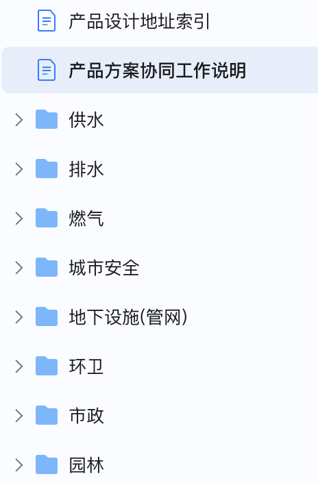

# 产品方案协同工作说明
## 一、目的
鉴于当前市政应用研发部涉及多条业务线，不同业务之间既存在共性内容，也有各自特色。为了更好的组织同一业务线方案负责人、产品经理、研发负责人之间的沟通协调，计划将原有沟通机制加以明确并常态化落实，每条业务线形成一个至少包含方案、产品、研发的作战小团队，确保公司产品和方案内容的一致性，提升方案的竞争力并保障项目的顺利交付实施。
## 二、沟通机制
### 1.常态化沟通渠道
每个条线建立专门的钉钉群，包含对应的业务负责人、产品经理、研发负责人。可随时针对方案内容、项目需求、产品设计等发起讨论。
### 2.定期沟通
每个月第三周周五前，对应产品线牵头人进行一次碰头会。  
方案负责人反馈当月方案的完善和新需求情况；产品经理反馈对应产品的设计工作情况；研发侧反馈产品研发落实情况及计划。  
月沟通例会要形成文档，放在各业务条线的月例会文件夹中。
### 3.成果更新机制
- 标准方案及报价清单：方案负责人负责更新方案到企业微信，并将更新内容同步给业务线其他人员；
- 产品手册：产品经理负责维护需求池和产品手册；
- 重点需求：产品负责人、研发负责人负责整理已有项目需求；
- 重点项目介绍文档：由方案负责人跟项目现场项目经理共同整理。
### 4.文档存储
- 存在在钉钉知识库中，[钉钉文档地址](https://alidocs.dingtalk.com/i/team/9JOGOby7qgk9am4Q)
- 文档包含：标准方案、报价清单、产品手册、需求池、重点项目介绍文档.
- 按照不同行业建立单独文件夹，授权访问对象为 “大市政业务互动”群成员.

## 三、业务条线人员  

|序号|业务线|类型|牵头人|方案负责人|产品负责人|研发负责人|
|:----:|----|-----|----|----|----|----|
|1|环卫/垃圾分类|专项|冯玄韬|吴佳兴|冯玄韬|李勇|
|2|园林(公园、古树)|专项|柳旺|柳旺|冯玄韬|袁方波|
|3|市政(道桥、路灯、井盖)|专项|柳旺|柳旺|魏雄|唐念刚|
|4|地下市政设施|专项|赵管乐|赵管乐|魏雄|唐念刚|
|5|地下管网|专项|曾航|曾航|冯玄韬(兼)|桑雷|
|6|排水、防汛|专项|李超|李超|路锟(兼)|桑雷|
|7|供水|专项|洪源|洪源|胡自和(兼)|胡自和(兼)|
|8|燃气|专项|路锟|曾航|路锟|袁方波|
|9|城市安全运行|综合|宋宇震|柳旺、李伟|路锟|袁方波|

> 相关方案、产品、研发负责人如有变更，由宋宇震、李伟、胡自和提前商定告知。

## 四、近期具体事项
- 各业务条线牵头人组织将对应的文档整理上传至对应的文件夹中。
- 各业务条线本周内组织一次碰头会，认认人。
- 已有部分业务建立有业务小群，至少包含对应的3位成员。各业务根据实际需要自行决定。
